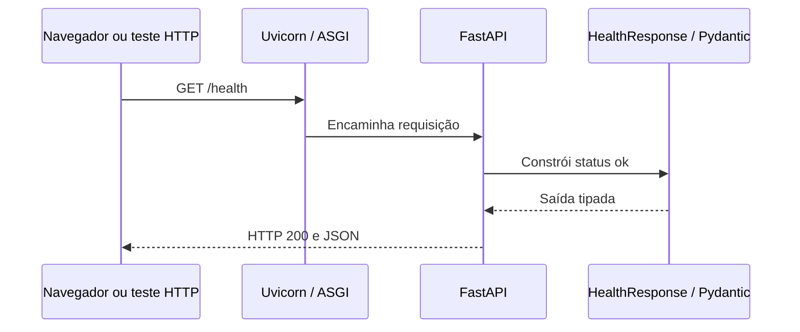
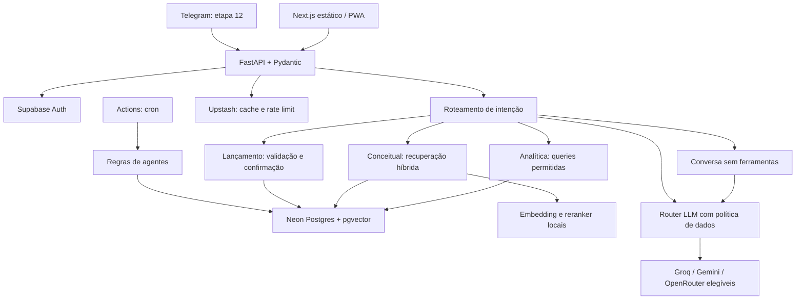

# Arquitetura

## Estado executável: etapa 1

Uma recepção pode responder que está aberta antes de existir um arquivo de clientes.
O `/health` é essa recepção: prova que o processo HTTP responde. Não demonstra
disponibilidade de banco, autenticação, LLM ou processamento financeiro.

A implementação está em `apps/api/app/main.py`; os testes HTTP e de contrato
estão em `apps/api/tests/test_health.py`. Não há SQL nesse caminho.
O OpenAPI é servido em `/openapi.json`, com interface interativa em `/docs`.

## Mapa do monorepo

| Caminho | Responsabilidade e estado |
| --- | --- |
| `apps/api/app` | API Python; somente saúde implementada |
| `apps/api/tests` | Testes locais sem serviços externos |
| `apps/web` | Destino documentado da interface; implementação na etapa 9 |
| `packages/mascot` | Identidade central; arte e consumidores na etapa 9 |
| `evals` | Destino dos experimentos RAG da etapa 6 |
| `docs` | Explicações e decisões por etapa |

Um `pyproject.toml` e um `uv.lock` na raiz gerenciam o único ambiente Python.
Não há workspace Python com múltiplos pacotes porque só existe uma aplicação.
As dependências Node serão adicionadas quando houver código frontend.

## Arquitetura aprovada, ainda não implementada

No fluxo financeiro futuro, a rota autenticará o usuário e validará a entrada;
o serviço aplicará regras e autorização; o repositório executará SQL parametrizado.
O identificador do usuário virá da sessão validada, nunca do corpo da requisição.
Dinheiro será calculado deterministicamente; embeddings não somam transações.
Os valores serão validados antes de qualquer apresentação por streaming.

Não criamos classes vazias de service/repository, módulos core/RAG nem adapters
antecipadamente. Cada fronteira ganha código quando existir um fluxo real.

## Desenvolvimento e limites

`make check` executa ruff, mypy estrito em toda a API atual e pytest com cobertura
mínima de 80%. Docker Compose fornece Postgres 17 com pgvector disponível e Redis
7.4, ambos acessíveis apenas pelo loopback. A API ainda não conecta a esses serviços.

O teste do contrato verifica o endpoint e o schema de saúde. Uma política completa
de compatibilidade de OpenAPI será ampliada com endpoints de negócio.
Não existe migration; o modelo de dados será revisado com Enzo na etapa 2.

Produção gratuita permanece uma hipótese: embedding e reranker precisam caber
no orçamento de memória do provedor. Render é candidato; não há serviço publicado.
