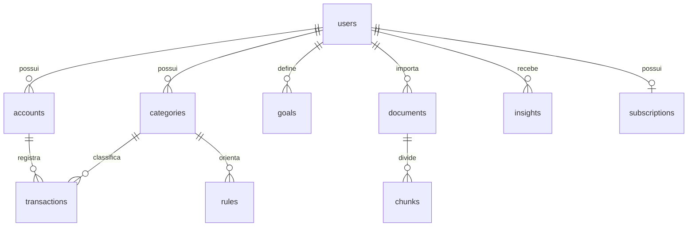

# Dados — revisão da etapa 2

Em 19/09/2026, Enzo autorizou revisar o schema, executar a etapa 2, instalar
dependências e seguir para a migration. Esta revisão precede a geração de tabelas.
Escopo: dez modelos solicitados; autenticação HTTP e ingestão ficam para etapas 3/4.

## Decisões e consequências

Dinheiro funciona como contar moedas de um centavo: `BIGINT` armazena centavos,
sem arredondamento binário. A primeira versão aceita apenas BRL. Transações têm
data civil (`booked_on`), valor assinado e tipo receita/despesa/transferência;
transferências não entram em totais de consumo. Datas de criação usam UTC.
O saldo inicial representa o começo de `opening_date`; consultas de saldo devem
considerar lançamentos a partir dessa data, evitando contar histórico duas vezes.

UUIDs permitem usar o `sub` do Supabase como ID do usuário sem copiar senhas ou
depender de uma FK para outro serviço. Demais IDs são UUIDs gerados pela aplicação.
Cada tabela privada tem `user_id` obrigatório. Relações internas usam o par
`(user_id, id)`, pois uma FK só para `id` permitiria apontar para outra pessoa.

## Tabelas e invariantes revisadas

| Tabela | Conteúdo e restrições |
| --- | --- |
| `users` | UUID externo, data de criação; sem CPF, senha ou e-mail duplicado |
| `accounts` | Nome cifrado, tipo, BRL, saldo inicial em centavos e data-base |
| `categories` | Nome genérico por usuário, único dentro do usuário |
| `transactions` | Conta, categoria opcional, data, centavos, tipo, descrição cifrada e chave de deduplicação |
| `rules` | Padrão cifrado, categoria do mesmo usuário, prioridade e habilitação |
| `goals` | Descrição cifrada, alvo positivo em centavos e prazo opcional |
| `documents` | Nome e conteúdo cifrados, tipo e digest para idempotência |
| `chunks` | Documento do mesmo usuário, posição única, texto cifrado e vetor opcional de 384 dimensões |
| `insights` | Tipo de agente, conteúdo cifrado, chave idempotente, leitura opcional |
| `subscriptions` | Uma por usuário, plano free/pro e estado; não representa assinatura recorrente de uma despesa |

Excluir usuário remove seus dados por cascata, inclusive chunks. Excluir documento
remove seus chunks. Excluir conta/categoria referenciada é recusado para preservar
histórico; primeiro é preciso tratar seus vínculos. A exclusão no Supabase Auth será
coordenada na etapa 3. Não prometer exclusão instantânea de backups externos.

## Criptografia e recuperação

Textos pessoais ficam em `bytea`, cifrados com AES-256-GCM e nonce aleatório.
O contexto autenticado inclui usuário e finalidade do campo: copiar ciphertext
de outra pessoa/campo não o torna legível. A chave fica fora do banco e do Git.
Perder a chave perde os textos; guardar banco e chave no mesmo backup elimina parte
da proteção. Rotação de chaves exigirá migração explícita antes de produção.
Implementação: `apps/api/app/crypto.py`; testes cobrem adulteração, chave incorreta,
troca de usuário/finalidade, nonces diferentes e identidade de operação.

Nenhuma descrição privada em claro, `tsvector` ou cópia de texto será persistida
para contornar a criptografia. O FTS da base pública será definido na etapa 6;
busca textual privada pode operar sobre conteúdo decifrado temporariamente após
autorização. Isso custa mais CPU e não permite GIN sobre o texto privado cifrado.
Embeddings não são criptografia nem anonimização; permanecerão nulos nesta etapa.

## Deduplicação e índices

Um hash só de data/valor/descrição apagaria duas compras iguais. A chave será HMAC
SHA-256 com chave própria, conta/usuário e identidade estável da transação de origem.
Para CSV sem ID, o parser da etapa 4 terá de construir identidade com ocorrência
determinística; não assumimos que linha igual significa duplicata. Lançamento por
conversa terá chave de idempotência da operação. A constraint UNIQUE resolve a corrida.

Índices previstos: PKs UUID; pares únicos de dono/ID nas entidades referenciadas;
transações por usuário/data e usuário/conta/data; categoria por usuário/ID para FK;
nomes de categoria por usuário; regras por usuário/categoria; documentos por
usuário/digest; chunks por usuário/documento/posição; insights por usuário/chave;
metas por usuário; assinatura por usuário. Cada prefixo `user_id` atende a RLS.
Sem HNSW antecipado: primeiro busca exata sobre conjunto autorizado, depois medição.

## Isolamento e credenciais

RLS será habilitada e forçada nas tabelas privadas. O usuário da API não pode ser
superuser nem ter BYPASSRLS. O contexto `app.user_id` dura só a transação, evitando
vazamento entre conexões reutilizadas. Contexto ausente nega acesso.
A API futura deriva esse UUID de JWT validado; RLS não autentica um UUID escolhido
por um cliente. A conexão de migration é separada e não atende requisições HTTP.

## Plano de verificação

Testar em Postgres/pgvector reais: migration sobe e reverte em banco descartável;
constraints monetárias, duplicatas, FKs entre donos, cascatas, papel sem bypass,
leitura/escrita cruzada, contexto após rollback e armazenamento vetorial.
`make check` continua executável sem Docker; testes de integração terão comando
próprio obrigatório no CI, sem substituí-los por SQLite.
