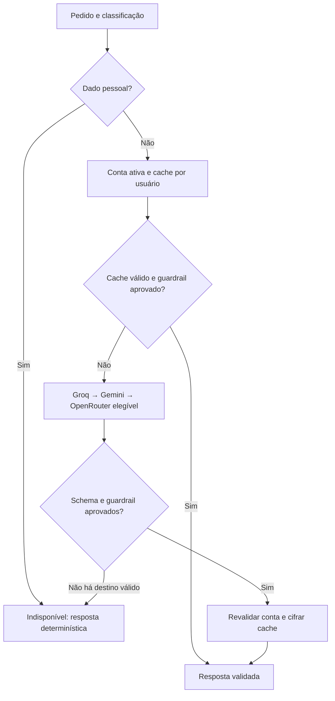

# Camada LLM — etapa 5

Plano: contratos → adapters HTTP → fallback/retry/circuit breaker → cache por
usuário → testes e documentação. Branch baseada na etapa 4 enquanto PR 8 está aberto.
Sem schema novo, SDK adicional ou transmissão automática de dados reais.

Um token é um pedaço de texto usado pelo modelo, não necessariamente uma palavra.
Contamos entrada e saída informadas pelo provedor; ausência de medição não vira zero
inventado. Limites de caracteres na entrada e tokens na saída limitam cada pedido.
Temperatura zero reduz variação, mas não garante verdade nem determinismo completo.

`Generation` separa instrução confiável e dado não confiável. Classificação padrão
é pessoal; o chamador precisa declarar explicitamente material sintético/público.
`Completion` contém texto e contagens; representações não incluem conteúdo privado.
Pydantic garante formato, não veracidade: `verify_money` compara ID/centavos com
fatos obtidos pelo chamador do SQL. Respostas monetárias livres não são aceitas
por esse contrato; o código deve renderizar os valores verificados.

Groq → Gemini → OpenRouter continua sendo a ordem aprovada no ADR 0005.
Gemini gratuito nunca recebe dados pessoais. Groq aceita perguntas/histórico mínimo após opt-in e confirmação de ZDR pelo
proprietário; envio de extratos continua fora dessa autorização.

Referências consultadas em 27/09/2026: [Groq structured outputs](https://console.groq.com/docs/structured-outputs),
[Gemini structured output](https://ai.google.dev/gemini-api/docs/structured-output),
[limites OpenRouter](https://openrouter.ai/docs/api_reference/limits).
JSON estruturado e streaming/tool calling não são combinados nesta implementação;
SSE para o produto pertence à etapa 7 e não deve transmitir JSON parcial não validado.

Os três adapters usam HTTP direto, destinos fixos e não seguem redirects. Respostas
acima de 128 KB, recusadas, incompletas ou sem contagem válida são descartadas.
Groq usa `openai/gpt-oss-20b`; Gemini usa `gemini-2.5-flash`; OpenRouter exige nome
terminado em `:free`, schema suportado e `data_collection=deny`. Esses filtros
não substituem revisar a conta sem faturamento e a disponibilidade do modelo.
Erro de provedor não reproduz corpo, prompt ou credencial. HTTP 429 respeita
Retry-After (segundos ou data); retry imediato é reservado a falhas transitórias.

`Router` tenta no máximo duas chamadas por provedor: somente transporte/408/5xx
admitem uma repetição com backoff de 250 ms. 429, credencial inválida e JSON sem
validade abrem o circuito; a chamada seguinte pula esse destino até o prazo.
Um teste reprova centavos inventados apesar de JSON válido. Se todos falharem,
`LLMUnavailable` exige fallback determinístico no chamador. Metadados incluem
somente destino, resultado, tempo e contagens; falha sem uso informado registra
`None`, nunca custo zero presumido. Circuitos são locais ao processo, não quotas
globais do fornecedor; reiniciar o processo perde esse estado transitório.

O cache Redis armazena respostas cifradas por usuário, com TTL de uma hora.
A chave do pedido usa HMAC de instrução/dados/schema/modelos; trocar qualquer um
invalida a reutilização. O contexto AES-GCM inclui usuário e pedido, impedindo
reaproveitar um ciphertext copiado para outro dono. Cada usuário ocupa um hash
de até 64 entradas; ao encher, o hash é reiniciado. É cache descartável, nunca
fonte de verdade. Conteúdo vencido não é devolvido mesmo se outras entradas
mantiverem o hash ativo. A exclusão remove o hash inteiro.

`llm_service.generate` exige usuário existente e ativo antes do cache/chamada e
novamente antes de salvar/devolver. Assim, exclusão concorrente não repovoa cache.
Uma resposta em cache passa outra vez pelo schema e pelo guardrail atual. Falha de
cache permite chamar o router; falha ao remover cache durante exclusão mantém o
marcador pendente para retomada. Preserve as credenciais Redis durante a exclusão.

Configuração padrão: `LLM_ENABLED=false`, `LLM_CACHE=off`. Para ensaio remoto,
revisar contas sem faturamento, preencher chaves de API e definir explicitamente
`LLM_FREE_TIER_CONFIRMED=true`; isso é confirmação operacional, não detecção
automática de plano. Mudança de configuração exige reinício do processo.
Nenhuma rota pública aceita classificação de privacidade fornecida pelo usuário.
Integração com importação pessoal permanece bloqueada até revisão dos provedores.

O teste de integração roda o Lua no Redis do Compose, verifica capacidade/TTL,
simula indisponibilidade ao excluir e retoma a exclusão no PostgreSQL real.
Testes automáticos locais não usam credenciais de LLM. Os adapters são exercitados com transporte
HTTP simulado, incluindo timeout, resposta truncada, uso ausente e modelo pago.

O timeout HTTP de 10 s limita cada espera de rede. Um prazo adicional de 15 s é
conferido entre chunks para interromper respostas que chegam lentamente sem nunca
estourar o timeout de leitura. Não é prazo global rígido: uma leitura já iniciada
pode consumir seu próprio timeout; retries e destinos somam latência.

## Ensaio e operação

`make llm-smoke` usa exclusivamente um exemplo sintético fixo e valida seu valor.
Só imprime tentativas, latência e uso; sai com erro quando desabilitado/indisponível.
Não cadastra conta, não ativa faturamento e não modifica o ledger. Chaves de painel
Supabase/Upstash não servem para esse teste: são necessárias chaves dos provedores LLM.

Streaming mostra pedaços antes da resposta terminar e reduz a espera percebida.
Aqui preferimos validar o JSON completo; etapa 7 pode emitir via SSE o resultado
validado. Não confundir streaming de transporte com autorização para mostrar
números ainda não conferidos.

| Destino permitido | Custo por 1.000 tokens no modo exigido | Condição |
| --- | --- | --- |
| Groq Free | US$ 0 dentro da quota | Conta sem faturamento; limite por modelo |
| Gemini Free | US$ 0 dentro da quota | Somente público/sintético, projeto sem billing |
| OpenRouter `:free` | US$ 0 | Modelo gratuito elegível e quota da conta |

Não há conversão automática para modalidade paga. A confirmação no ambiente não
é prova de plano: [preços Gemini](https://ai.google.dev/gemini-api/docs/pricing),
[limites Groq](https://console.groq.com/docs/rate-limits) e painel precisam ser
conferidos antes do primeiro ensaio. Após configurar Groq, o smoke sintético real
passou: 287 tokens de entrada, 120 de saída, 483 ms reportados pela chamada.
A etapa 6 mediu também geração/judge públicos; consumo e falhas em `04-RAG.md`.
Gemini/OpenRouter continuam sem ensaio remoto. O ensaio público não autoriza dados pessoais; a autorização posterior está abaixo.
# Política pessoal aprovada em 03/10/2026

Enzo autorizou somente Groq e confirmou ZDR ativo na organização da chave.
O navegador da sessão estava indisponível; a confirmação é do titular, não uma
auditoria visual independente. `GROQ_PERSONAL_DATA_ENABLED=true` e
`GROQ_ZDR_CONFIRMED=true` são exigidos junto das flags de LLM/free tier.
Serviço, router e adapter aplicam a mesma política. Falha/429 no Groq nunca envia
perguntas ou histórico pessoais a Gemini/OpenRouter. O fallback é local.
As flags são declaração operacional; a API não verifica o painel automaticamente.
